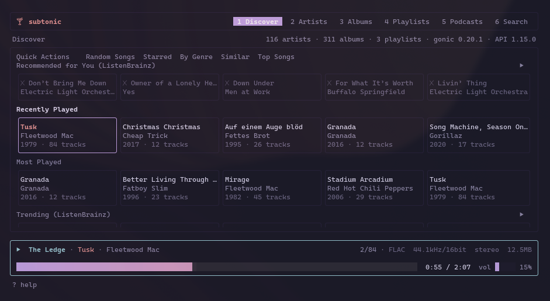
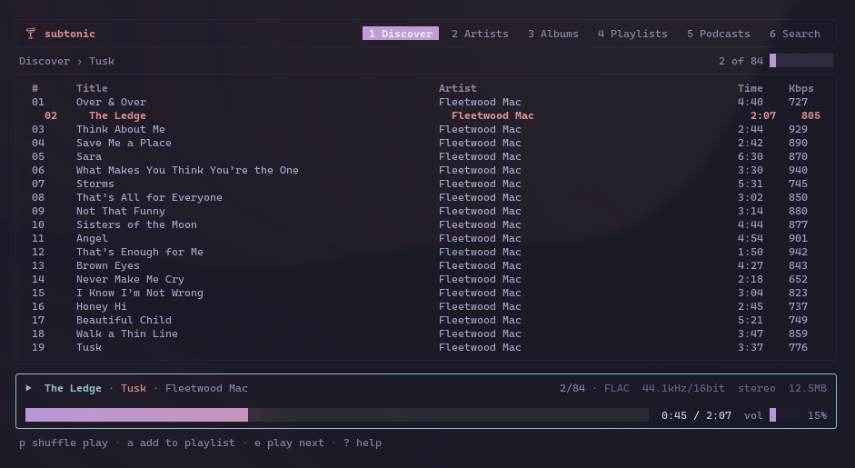
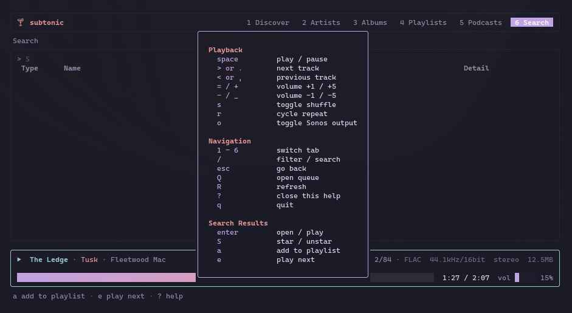
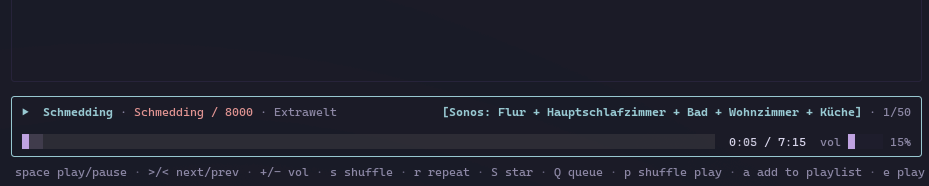
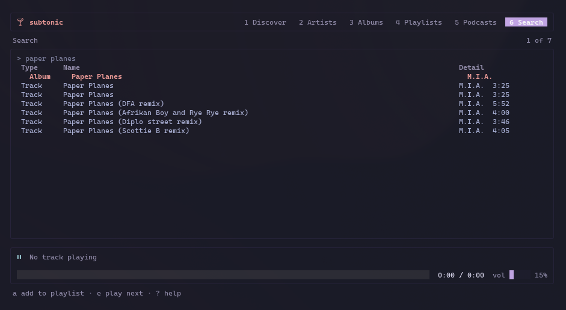

# subtonic

Terminal UI for Subsonic-compatible music servers.



## Requirements

- A running Subsonic-compatible server (Navidrome, Airsonic, etc.)
- Go 1.21+

## Install

```
go install github.com/Flipez/subtonic@latest
```

Or build from source:

```
git clone https://github.com/Flipez/subsonic-tui
cd subsonic-tui
go build -o subtonic .
```

## Configuration

On first run a config file is created at `~/.config/subtonic/config.toml`:

```toml
[server]
url      = "https://my-server.com"
username = "user"
password = "pass"

[player]
volume = 80
```

## Usage

```
subtonic
```



### Navigation

| Key | Action |
|-----|--------|
| `1`–`6` | Switch tab (Discover / Artists / Albums / Playlists / Podcasts / Search) |
| `enter` | Open / play |
| `esc` | Go back |
| `/` | Filter current list |
| `R` | Refresh |
| `?` | Show all keybindings |
| `q` | Quit |

### Playback

| Key | Action |
|-----|--------|
| `space` | Play / pause |
| `>` `.` | Next track |
| `<` `,` | Previous track |
| `=` | Volume +1% |
| `+` | Volume +5% |
| `-` | Volume -1% |
| `_` | Volume -5% |
| `s` | Toggle shuffle |
| `r` | Cycle repeat (off / all / one) |
| `Q` | Open queue |

Press `?` to see all keybindings in the app.



### Sonos

Press `o` to discover and connect to a Sonos speaker or group. Playback routes directly from the server to the speaker — the TUI controls what plays. Press `o` again to switch back to local audio. The current song and position carry over in both directions.



## Tabs

**Discover** — Quick actions (random, starred, by genre, similar, top songs) plus ListenBrainz sections if a username is configured.

**Artists / Albums / Playlists / Podcasts** — Browse your library.

**Search** — Server-side search across artists, albums, and tracks.



## ListenBrainz

Optional. Add to config to enable trending tracks, fresh releases, and personalised recommendations:

```toml
[listenbrainz]
username = "your-lb-username"
token    = "your-lb-token"   # only needed for recommendations
```
